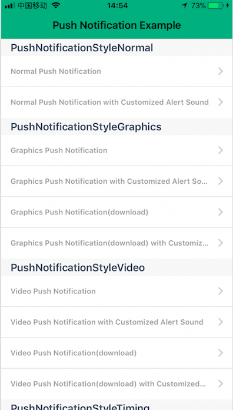
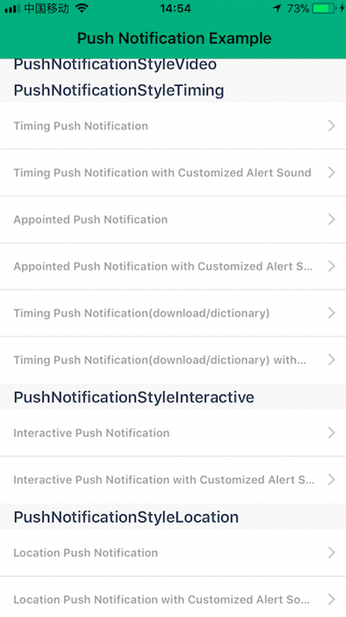
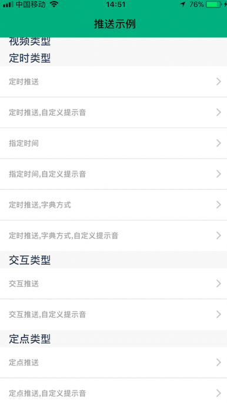
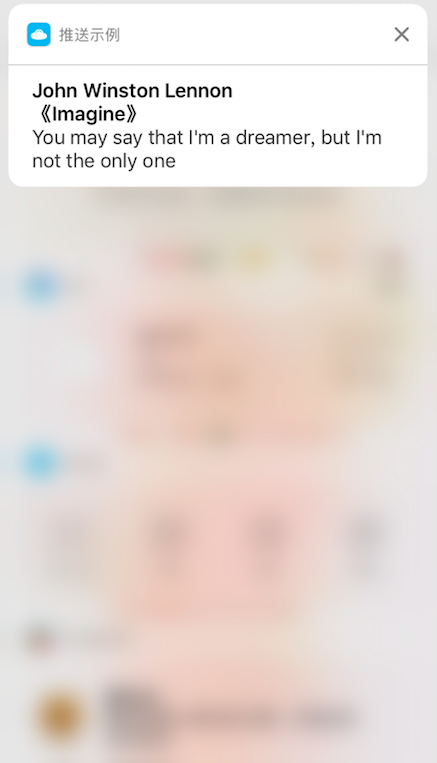
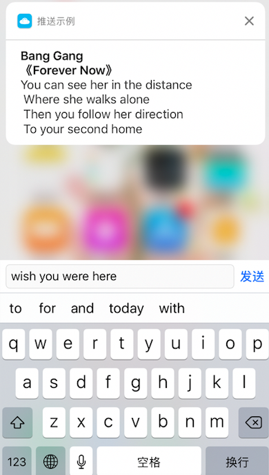
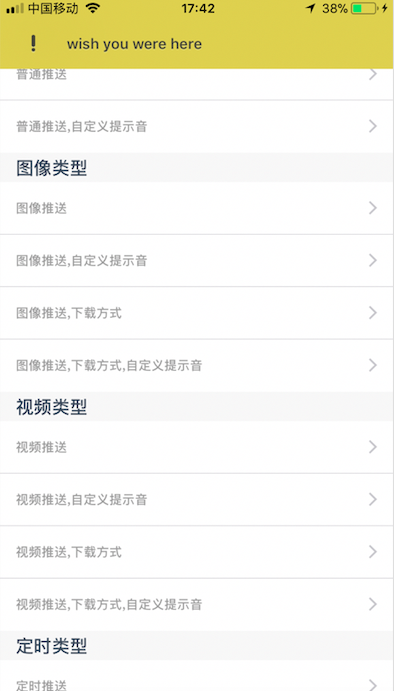

# PushNotificationManager 
&nbsp;
&nbsp;
&nbsp;
&nbsp;

&emsp;&emsp;Convenient and comprehensive api for push notification ,provide 6 stems and 20 branchs' function,offer examples written by Objective-C and Swift respectively<br/>
 1. push notification style of normal
    - normal with default alert sound
    - provide a customized alert sound
 2. push notification style of graphics
    - normal with default alert sound
    - provide a customized alert sound
    - provide a graphics download from internet
    - provide a graphics download from internet and a customized alert sound
 3. push notification style of video
    - normal with default alert sound
    - provide a customized alert sound
    - provide a video download from internet
    - provide a video download from internet and a customized alert sound
 4. push notification style of timing(Chinses Time)
    - normal with default alert sound(weekday、hour、minute、second)
    - provide a customized alert sound(weekday、hour、minute、second)
    - push notification style of timing like `2017-10-1`(year、month、day、hour、minute、second)
    - push notification style of timing like `2017-10-1`(year、month、day、hour、minute、second) and a customized alert sound
    - push notification style of timing,the fire date is included in a dictionary
    - push notification style of timing,the fire date is included in a dictionary,provide a customized alert sound
 5. push notification style of interactive(the max action is four)
    - normal with default alert sound
    - provide a customized alert sound
 6. push notification style of location
    - normal with default alert sound
    - provide a customized alert sound
 ### Preview
 mainpage screenshot1  | mainpage screenshot2 | mainpage screenshot3 | mainpage screenshot4
 -----|-----|-----|-----
  |   |   |  
 
 push notification style of normal | push notification style of graphics | push notification style of video
 -----|-----|-----
 |  |  
 
 interactive setp1 | interactive setp2 | interactive setp3
 -----|-----|-----
  |   |  
 ### Directory
 <pre>
 PushNotification.h
 PushNotification.m
</pre>
### License
`PushNotificationManager`use[__MIT license__][1]protocol
### Installation with cocoapods
<pre>
 pod 'PushNotificationManager'
</pre>
### Examples:
 - make sure you install the`PushNotificationManager`with cocoapods or import the files of`PushNotificationManager`before use
#### Apply the push notification permission
```
    if (kSystemVersion >= 10.0) {
        UNUserNotificationCenter *center = [UNUserNotificationCenter currentNotificationCenter];
        center.delegate = self;
        UNAuthorizationOptions types=UNAuthorizationOptionBadge|UNAuthorizationOptionAlert|UNAuthorizationOptionSound;
        [center requestAuthorizationWithOptions:types completionHandler:^(BOOL granted, NSError * _Nullable error) {
            if (granted) {
            [center getNotificationSettingsWithCompletionHandler:^(UNNotificationSettings * _Nonnull settings) {
                
            }];
            } else {
            [[UIApplication sharedApplication]openURL:[NSURL URLWithString:UIApplicationOpenSettingsURLString] options:@{UIApplicationOpenURLOptionUniversalLinksOnly:@""} completionHandler:^(BOOL success) { }];
            }
        }];
    }else if (kSystemVersion >= 8.0){
#pragma clang diagnostic push
#pragma clang diagnostic ignored "-Wdeprecated-declarations"
        [application registerUserNotificationSettings:[UIUserNotificationSettings settingsForTypes:UIUserNotificationTypeAlert | UIUserNotificationTypeSound | UIUserNotificationTypeBadge categories:nil]];
#pragma clang diagnostic pop
    }
```
#### `push notification style of normal` ->`普通推送`
```
-(void)normalPushNotificationWithTitle:(NSString *)title subTitle:(NSString *)subTitle body:(NSString *)body identifier:(NSString *)identifier timeInterval:(NSInteger)timeInterval repeat:(BOOL)repeat;
```
#### `push notification style of normal,provide a customized alert sound,e.g. @"intro.mp3"` ->`普通推送,可设置自定义提示音`
```
-(void)normalPushNotificationWithTitle:(NSString *)title subTitle:(NSString *)subTitle body:(NSString *)body identifier:(NSString *)identifier soundName:(NSString *)soundName timeInterval:(NSInteger)timeInterval repeat:(BOOL)repeat;
```
#### `push notification style of graphics,include the format of png、jpg、gif and other graphics formats` ->`图像推送,包含png、jpg、gif等图像格式`
```
-(void)graphicsPushNotificationWithTitle:(NSString *)title subTitle:(NSString *)subTitle body:(NSString *)body identifier:(NSString *)identifier fileName:(NSString *)fileName timeInterval:(NSInteger)timeInterval repeat:(BOOL)repeat;
```
#### `push notification style of graphics,provide a customized alert sound,e.g. @"intro.mp3"` ->`图像推送,可设置自定义提示音`
```
-(void)graphicsPushNotificationWithTitle:(NSString *)title subTitle:(NSString *)subTitle body:(NSString *)body identifier:(NSString *)identifier fileName:(NSString *)fileName soundName:(NSString *)soundName timeInterval:(NSInteger)timeInterval repeat:(BOOL)repeat;
```

#### `push notification style of graphics,provide a graphics download from internet` ->`图像推送,可以通过链接下载`
```
-(void)graphicsPushNotificationWithTitle:(NSString *)title subTitle:(NSString *)subTitle body:(NSString *)body identifier:(NSString *)identifier urlString:(NSString *)urlString timeInterval:(NSInteger)timeInterval repeat:(BOOL)repeat;
```

####`push notification style of graphics,provide a graphics download from internet and a customized alert sound,e.g. @"intro.mp3"` ->`图像推送,可以通过链接下载,可设置自定义提示音`
```
-(void)graphicsPushNotificationWithTitle:(NSString *)title subTitle:(NSString *)subTitle body:(NSString *)body identifier:(NSString *)identifier urlString:(NSString *)urlString soundName:(NSString *)soundName timeInterval:(NSInteger)timeInterval repeat:(BOOL)repeat;
```

#### `push notification style of video` ->`视频推送`
```
-(void)videoPushNotificationWithTitle:(NSString *)title subTitle:(NSString *)subTitle body:(NSString *)body identifier:(NSString *)identifier fileName:(NSString *)fileName timeInterval:(NSInteger)timeInterval repeat:(BOOL)repeat;
```

#### `push notification style of video,provide a customized alert sound,e.g. @"intro.mp3"` ->`视频推送,可设置自定义提示音`
```
-(void)videoPushNotificationWithTitle:(NSString *)title subTitle:(NSString *)subTitle body:(NSString *)body identifier:(NSString *)identifier fileName:(NSString *)fileName soundName:(NSString *)soundName timeInterval:(NSInteger)timeInterval repeat:(BOOL)repeat;
```

#### `push notification style of video,provide a video download from internet` ->`视频推送,可以通过链接下载`
```
-(void)videoPushNotificationWithTitle:(NSString *)title subTitle:(NSString *)subTitle body:(NSString *)body identifier:(NSString *)identifier urlString:(NSString *)urlString timeInterval:(NSInteger)timeInterval repeat:(BOOL)repeat;
```

#### `push notification style of video,provide a video download from internet and a customized alert sound,e.g. @"intro.mp3"`` ->`视频推送,可以通过链接下载,可设置自定义提示音`
```
-(void)videoPushNotificationWithTitle:(NSString *)title subTitle:(NSString *)subTitle body:(NSString *)body identifier:(NSString *)identifier urlString:(NSString *)urlString soundName:(NSString *)soundName timeInterval:(NSInteger)timeInterval repeat:(BOOL)repeat;
```

#### `push notification style of timing` ->`定时推送`
```
-(void)timingPushNotificationWithTitle:(NSString *)title subTitle:(NSString *)subTitle body:(NSString *)body identifier:(NSString *)identifier weekday:(NSString *)weekday hour:(NSString *)hour minute:(NSString *)minute second:(NSString *)second timeInterval:(NSInteger)timeInterval repeat:(BOOL)repeat;
```

#### `push notification style of timing,provide a customized alert sound,e.g. @"intro.mp3"` ->`定时推送,可设置自定义提示音`
```
-(void)timingPushNotificationWithTitle:(NSString *)title subTitle:(NSString *)subTitle body:(NSString *)body identifier:(NSString *)identifier weekday:(NSString *)weekday hour:(NSString *)hour minute:(NSString *)minute second:(NSString *)second soundName:(NSString *)soundName timeInterval:(NSInteger)timeInterval repeat:(BOOL)repeat;
```

#### `push notification style of timing(ex.2017-10-1 5:12)` ->`定时推送(行如2017-10-1 5:12)`
```
-(void)timingPushNotificationWithTitle:(NSString *)title subTitle:(NSString *)subTitle body:(NSString *)body identifier:(NSString *)identifier year:(NSString *)year month:(NSString *)month day:(NSString *)day hour:(NSString *)hour minute:(NSString *)minute second:(NSString *)second timeInterval:(NSInteger)timeInterval repeat:(BOOL)repeat;
```

#### `push notification style of timing(ex.2017-10-1 5:12),provide a customized alert sound,e.g. @"intro.mp3"` ->`定时推送,可设置自定义提示音(行如2017-10-1 5:12)`
```
-(void)timingPushNotificationWithTitle:(NSString *)title subTitle:(NSString *)subTitle body:(NSString *)body identifier:(NSString *)identifier year:(NSString *)year month:(NSString *)month day:(NSString *)day hour:(NSString *)hour minute:(NSString *)minute second:(NSString *)second soundName:(NSString *)soundName timeInterval:(NSInteger)timeInterval repeat:(BOOL)repeat;
```

```
//    NSDictionary *dict = @{@"weekday":@1, //the `1` said Sunday in China ->`1`等于中国周日
//                           @"hour":@2,
//                           @"minute":@20,
//                           @"second":@10
//                           }; // this meaning the fire date is "2:20:10 Sunday" ->字典的内容表示"周日 2:20:10"
```
#### `push notification style of timing,the fire date is included in a dictionary,the fireDate usage is as follows` ->`定时推送,推送时间包含在字典内,字典使用方法如下`
```
-(void)timingPushNotificationWithTitle:(NSString *)title subTitle:(NSString *)subTitle body:(NSString *)body identifier:(NSString *)identifier fireDate:(NSDictionary *)fireDate timeInterval:(NSInteger)timeInterval repeat:(BOOL)repeat;   // the fire date include the properities,such as era,year,month,day,hour,minute,second,nanosecond,weekday,weekdayOrdinal,quarter,weekOfMonth,weekOfYear,yearForWeekOfYear
```

#### `push notification style of timing,the fire date is included in a dictionary,provide a customized alert sound,e.g. @"intro.mp3"` ->`定时推送,推送时间包含在字典内,可设置自定义提示音`
```
-(void)timingPushNotificationWithTitle:(NSString *)title subTitle:(NSString *)subTitle body:(NSString *)body identifier:(NSString *)identifier fireDate:(NSDictionary *)fireDate soundName:(NSString *)soundName timeInterval:(NSInteger)timeInterval repeat:(BOOL)repeat;
```

#### `push notification style of interactive` ->`交互推送`
```
-(void)interactivePushNotificationWithTitle:(NSString *)title subTitle:(NSString *)subTitle body:(NSString *)body identifier:(NSString *)identifier identifierArray:(NSArray<NSString *> *)identifierArray actionArray:(NSArray<UNNotificationAction *> *)actionArray timeInterval:(NSInteger)timeInterval repeat:(BOOL)repeat;
```

#### `push notification style of interactive,provide a customized alert sound,e.g. @"intro.mp3"` ->`交互推送,可设置自定义提示音`
```
-(void)interactivePushNotificationWithTitle:(NSString *)title subTitle:(NSString *)subTitle body:(NSString *)body identifier:(NSString *)identifier identifierArray:(NSArray<NSString *> *)identifierArray actionArray:(NSArray<UNNotificationAction *> *)actionArray soundName:(NSString *)soundName timeInterval:(NSInteger)timeInterval repeat:(BOOL)repeat;
```

#### `push notification style of location` ->`定点推送`
```
-(void)locationPushNotificationWithTitle:(NSString *)title subTitle:(NSString *)subTitle body:(NSString *)body identifier:(NSString *)identifier longitude:(CGFloat)longitude latitude:(CGFloat)latitude radius:(NSInteger)radius notifyOnEntry:(BOOL)notifyOnEntey ontifyOnExit:(BOOL)notifyOnExit repeat:(BOOL)repeat;
```

#### `push notification style of location,provide a customized alert sound,e.g. @"intro.mp3"` ->`定点推送,可设置自定义提示音`
```
-(void)locationPushNotificationWithTitle:(NSString *)title subTitle:(NSString *)subTitle body:(NSString *)body identifier:(NSString *)identifier longitude:(CGFloat)longitude latitude:(CGFloat)latitude radius:(NSInteger)radius notifyOnEntry:(BOOL)notifyOnEntey ontifyOnExit:(BOOL)notifyOnExit soundName:(NSString *)soundName repeat:(BOOL)repeat;
```

#### `Receives the push notification in the foreground`->`前台收到推送`
```
// you can see the detail in the project named `PushNotificationManagerExample-ObjC`
- (void)userNotificationCenter:(UNUserNotificationCenter *)center willPresentNotification:(UNNotification *)notification withCompletionHandler:(void (^)(UNNotificationPresentationOptions options))completionHandler{}
```

#### `Receives the push notification in the background`->`应用在后台收到推送的处理方法`
```
// you can see the detail in the project named `PushNotificationManagerExample-ObjC`
-(void)userNotificationCenter:(UNUserNotificationCenter *)center didReceiveNotificationResponse:(UNNotificationResponse *)response withCompletionHandler:(void (^)(void))completionHandler{}
```
<hr>
 

### [__简书__][2]


[1]: https://github.com/GREENBANYAN/PushNotificationManager/blob/master/LICENSE "MIT License"
[2]: http://www.jianshu.com/p/e607046d6515 "简书"

