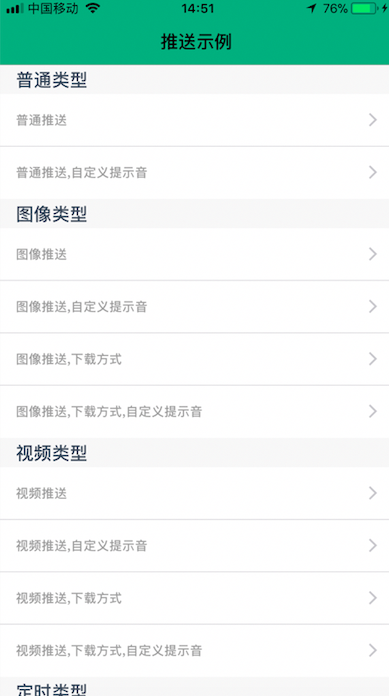
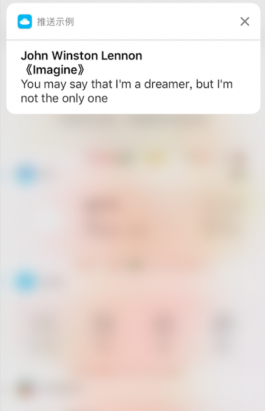
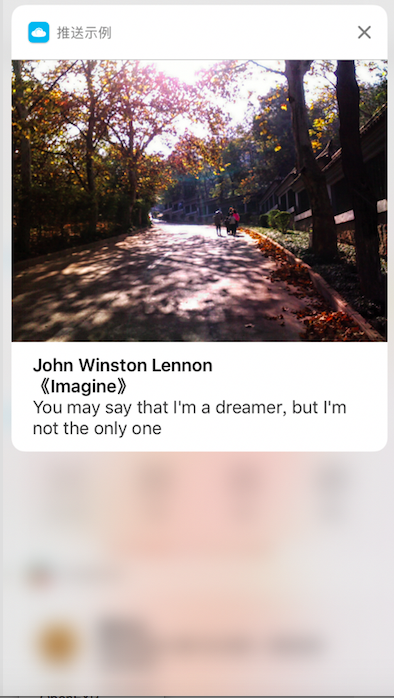
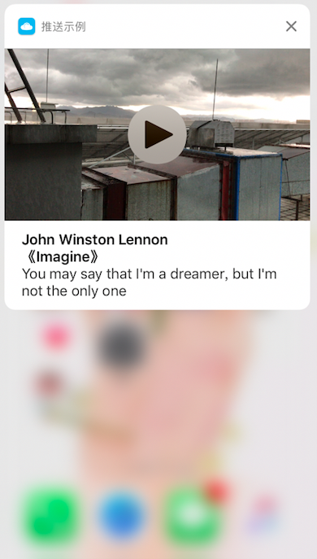
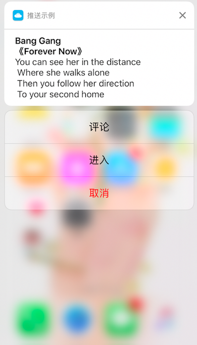
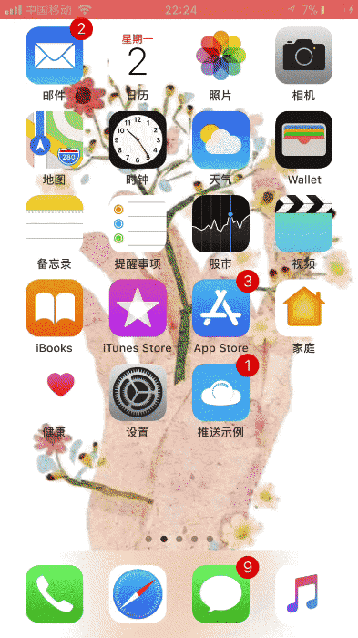
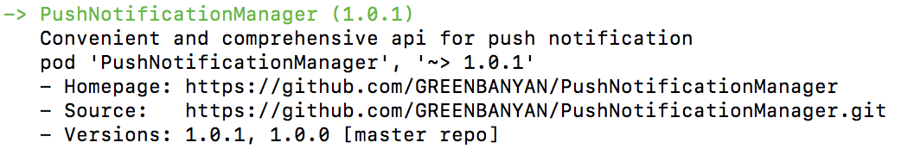

# PushNotificationManager 
&nbsp;
&nbsp;
&nbsp;
&nbsp;
&nbsp;
&nbsp;

&emsp;&emsp;Convenient and comprehensive api for push notification ,provide 6 stems and 20 branchs' function,offer examples written by Objective-C and Swift respectively<br/>

## Index
- [Asset](./Asset)<br/>
   project assets for local push notification,include picture、image and video
- [PushNotificationManager](./PushNotificationManager)<br/>
   push notification API
- [PushNotificationManagerExample-ObjC](./PushNotificationManagerExample-ObjC)<br/>
   the example for API usage written by Objective-C
- [PushNotificationManagerExample-Swift](./PushNotificationManagerExample-Swift)<br/>
   the example for API usage written by Swift
- [Screenshot](./Screenshot)<br/>
   project operation screenshot 

## Catalog
- [API](#API) 
- [Brief](#Brief)
- [Preview](#Preview) 
- [License](#License) 
- [Installation with cocoapods](#Installation) 
- [Examples both Objective-C and Swift](#Examples)
 
<a name="API"></a>
### API
 <pre>
 PushNotificationManager.h
 PushNotificationManager.m
</pre>

<a name="Brief"></a>
### Brief
 1. push notification style of normal
    - normal with default alert sound
    - provide a customized alert sound
 2. push notification style of graphics
    - normal with default alert sound
    - provide a customized alert sound
    - provide a graphics download from internet
    - provide a graphics download from internet and a customized alert sound
 3. push notification style of video
    - normal with default alert sound
    - provide a customized alert sound
    - provide a video download from internet
    - provide a video download from internet and a customized alert sound
 4. push notification style of timing(Chinses Time)
    - normal with default alert sound(weekday、hour、minute、second)
    - provide a customized alert sound(weekday、hour、minute、second)
    - push notification style of timing like `2017-10-1`(year、month、day、hour、minute、second)
    - push notification style of timing like `2017-10-1`(year、month、day、hour、minute、second) and a customized alert sound
    - push notification style of timing,the fire date is included in a dictionary
    - push notification style of timing,the fire date is included in a dictionary,provide a customized alert sound
 5. push notification style of interactive(the max action is four)
    - normal with default alert sound
    - provide a customized alert sound
 6. push notification style of location
    - normal with default alert sound
    - provide a customized alert sound

<a name="Preview"></a>
### Preview
 mainpage screenshot1  | mainpage screenshot2 | mainpage screenshot3 | mainpage screenshot4
 -----|-----|-----|-----
  |   |   |  
 
 push notification style of normal | push notification style of graphics | push notification style of video
 -----|-----|-----
 |  |  

 interactive setp1 | interactive setp2 | interactive setp3
 -----|-----|-----
  |  |  
 
  interactive gif | video gif 
 -----|-----
   |  

<a name="License"></a>
### License
`PushNotificationManager`use [__MIT license__][1]

<a name="Installation"></a>
### Installation with cocoapods
<pre>
 pod 'PushNotificationManager'
</pre>
 
 
<a name="Examples"></a>
### Examples
&emsp;&emsp;make sure you install the`PushNotificationManager`with cocoapods or import the files of`PushNotificationManager`before use
#### Apply the push notification permission
 - Objective-C
```
    if (kSystemVersion >= 10.0) {
        UNUserNotificationCenter *center = [UNUserNotificationCenter currentNotificationCenter];
        center.delegate = self;
        UNAuthorizationOptions types=UNAuthorizationOptionBadge|UNAuthorizationOptionAlert|UNAuthorizationOptionSound;
        [center requestAuthorizationWithOptions:types completionHandler:^(BOOL granted, NSError * _Nullable error) {
            if (granted) {
            [center getNotificationSettingsWithCompletionHandler:^(UNNotificationSettings * _Nonnull settings) {
                
            }];
            } else {
            [[UIApplication sharedApplication]openURL:[NSURL URLWithString:UIApplicationOpenSettingsURLString] options:@{UIApplicationOpenURLOptionUniversalLinksOnly:@""} completionHandler:^(BOOL success) { }];
            }
        }];
    }else if (kSystemVersion >= 8.0){
#pragma clang diagnostic push
#pragma clang diagnostic ignored "-Wdeprecated-declarations"
        [application registerUserNotificationSettings:[UIUserNotificationSettings settingsForTypes:UIUserNotificationTypeAlert | UIUserNotificationTypeSound | UIUserNotificationTypeBadge categories:nil]];
#pragma clang diagnostic pop
    }
```
- Swift
```
        if #available(iOS 10.0, *) {
            let notificationCenter = UNUserNotificationCenter.current()
            notificationCenter.delegate = self
            let types = UNAuthorizationOptions([.alert,.badge,.sound])
            notificationCenter.requestAuthorization(options: types, completionHandler: { (flag, error) in
                if flag {
                    print("注册成功")
                } else {
                    print("注册失败:\(error.debugDescription)")
                }
            })
        } else {
            let setting = UIUserNotificationSettings.init(types: [.alert, .badge, .sound], categories: nil)
            application.registerUserNotificationSettings(setting)
        }
        UIApplication.shared.registerForRemoteNotifications()
```
---
#### push notification style of normal
 - function
```
-(void)normalPushNotificationWithTitle:(NSString *)title 
                              subTitle:(NSString *)subTitle  
                                  body:(NSString *)body 
                            identifier:(NSString *)identifier 
                          timeInterval:(NSInteger)timeInterval 
                                repeat:(BOOL)repeat;
```
 - Objective-C usage
```
 [[PushNotificationManager sharedInstance]normalPushNotificationWithTitle:@"John Winston Lennon" subTitle:@"《Imagine》" body:@"You may say that I'm a dreamer, but I'm not the only one" identifier:@"1-1" timeInterval:3 repeat:NO];   //`repeat` if you pick the repeat property 'YES',you require to set the timeInterval value >= 60second ->是否重复,若要重复->时间间隔应>=60s
```
 - Swift usage
```
PushNotificationManager().normalPushNotification(withTitle: "John Winston Lennon", subTitle: "《Imagine》", body: "You may say that I'm a dreamer, but I'm not the only one", identifier: "1-1", timeInterval: 3, repeat: false)
```
---
#### push notification style of normal,provide a customized alert sound,e.g. @"intro.mp3"
 - function
```
-(void)normalPushNotificationWithTitle:(NSString *)title 
                              subTitle:(NSString *)subTitle 
                                  body:(NSString *)body 
                            identifier:(NSString *)identifier 
                             soundName:(NSString *)soundName 
                          timeInterval:(NSInteger)timeInterval 
                                repeat:(BOOL)repeat;
```
 - Objective-C usage
 ```
[[PushNotificationManager sharedInstance]normalPushNotificationWithTitle:@"John Winston Lennon" subTitle:@"《Imagine》" body:@"You may say that I'm a dreamer, but I'm not the only one" identifier:@"1-2" soundName:@"tmp.mp3" timeInterval:3 repeat:NO];
 ```
 - Swift usage
 ```
 PushNotificationManager().normalPushNotification(withTitle: "John Winston Lennon", subTitle: "《Imagine》", body: "You may say that I'm a dreamer, but I'm not the only one", identifier: "1-2", soundName: "tmp.mp3", timeInterval: 3, repeat: false)
 ```
 ---
#### push notification style of graphics,include the format of png、jpg、gif and other graphics formats
 - function
```
-(void)graphicsPushNotificationWithTitle:(NSString *)title
                                subTitle:(NSString *)subTitle 
                                    body:(NSString *)body 
                              identifier:(NSString *)identifier 
                                fileName:(NSString *)fileName 
                            timeInterval:(NSInteger)timeInterval 
                                  repeat:(BOOL)repeat;
```
 - Objective-C usage
 ```
[[PushNotificationManager sharedInstance]graphicsPushNotificationWithTitle:@"John Winston Lennon" subTitle:@"《Imagine》" body:@"You may say that I'm a dreamer, but I'm not the only one" identifier:@"2-1" fileName:@"Graphics.jpg" timeInterval:3 repeat:NO];
 ```
 - Swift usage
```
PushNotificationManager().graphicsPushNotification(withTitle: "John Winston Lennon", subTitle: "《Imagine》", body: "You may say that I'm a dreamer, but I'm not the only one", identifier: "2-1", fileName: "Graphics.jpg", timeInterval: 3, repeat: false)
```
 ---
#### push notification style of graphics,provide a customized alert sound,e.g. @"intro.mp3"
  - function
```
-(void)graphicsPushNotificationWithTitle:(NSString *)title 
                                subTitle:(NSString *)subTitle 
                                    body:(NSString *)body 
                              identifier:(NSString *)identifier 
                                fileName:(NSString *)fileName 
                               soundName:(NSString *)soundName 
                            timeInterval:(NSInteger)timeInterval 
                                  repeat:(BOOL)repeat;
```
 - Objective-C usage
```
[[PushNotificationManager sharedInstance]graphicsPushNotificationWithTitle:@"John Winston Lennon" subTitle:@"《Imagine》" body:@"You may say that I'm a dreamer, but I'm not the only one" identifier:@"2-2" fileName:@"Graphics.jpg" soundName:@"tmp.mp3" timeInterval:3 repeat:NO];
```
 - Swift usage
```
PushNotificationManager().graphicsPushNotification(withTitle: "John Winston Lennon", subTitle: "《Imagine》", body: "You may say that I'm a dreamer, but I'm not the only one", identifier: "2-2", fileName: "Graphics.jpg", soundName: "tmp.mp3", timeInterval: 3, repeat: false)
```
---
#### push notification style of graphics,provide a graphics download from internet
 - function
```
-(void)graphicsPushNotificationWithTitle:(NSString *)title 
                                subTitle:(NSString *)subTitle
                                    body:(NSString *)body 
                              identifier:(NSString *)identifier 
                               urlString:(NSString *)urlString
                            timeInterval:(NSInteger)timeInterval 
                                  repeat:(BOOL)repeat;
```
 - Objective-C usage
 ```
[[PushNotificationManager sharedInstance]graphicsPushNotificationWithTitle:@"John Winston Lennon" subTitle:@"《Imagine》" body:@"You may say that I'm a dreamer, but I'm not the only one" identifier:@"2-3" urlString:@"https://i.loli.net/2017/09/30/59cf8056a1e21.jpg" timeInterval:3 repeat:NO];
 ```
 - Swift usage
 ```
 PushNotificationManager().graphicsPushNotification(withTitle: "John Winston Lennon", subTitle: "《Imagine》", body: "You may say that I'm a dreamer, but I'm not the only one", identifier: "2-3", urlString: "https://i.loli.net/2017/09/30/59cf8056a1e21.jpg", timeInterval: 3, repeat: false)
 ```
 ---
#### push notification style of graphics,provide a graphics download from internet and a customized alert sound,e.g. @"intro.mp3"
 - function
```
-(void)graphicsPushNotificationWithTitle:(NSString *)title 
                                subTitle:(NSString *)subTitle
                                    body:(NSString *)body 
                              identifier:(NSString *)identifier 
                               urlString:(NSString *)urlString 
                               soundName:(NSString *)soundName 
                            timeInterval:(NSInteger)timeInterval
                                  repeat:(BOOL)repeat;
```
 - Objective-C usage
```
[[PushNotificationManager sharedInstance]graphicsPushNotificationWithTitle:@"John Winston Lennon" subTitle:@"《Imagine》" body:@"You may say that I'm a dreamer, but I'm not the only one" identifier:@"2-4" urlString:@"https://i.loli.net/2017/09/30/59cf8056a1e21.jpg" soundName:@"tmp.mp3" timeInterval:3 repeat:NO];
```
 - Swift usage
```
PushNotificationManager().graphicsPushNotification(withTitle: "John Winston Lennon", subTitle: "《Imagine》", body: "You may say that I'm a dreamer, but I'm not the only one", identifier: "2-4", urlString: "https://i.loli.net/2017/09/30/59cf8056a1e21.jpg", soundName: "tmp.mp3", timeInterval: 3, repeat: false)
```
---
#### push notification style of video
 - function
```
-(void)videoPushNotificationWithTitle:(NSString *)title 
                             subTitle:(NSString *)subTitle 
                                 body:(NSString *)body 
                           identifier:(NSString *)identifier 
                             fileName:(NSString *)fileName 
                         timeInterval:(NSInteger)timeInterval
                               repeat:(BOOL)repeat;
```
 - Objective-c usage
```
[[PushNotificationManager sharedInstance]videoPushNotificationWithTitle:@"John Winston Lennon" subTitle:@"《Imagine》" body:@"You may say that I'm a dreamer, but I'm not the only one" identifier:@"3-1" fileName:@"Raining.mp4" timeInterval:3 repeat:NO];
```
 - Swift usage
```
PushNotificationManager().videoPushNotification(withTitle: "John Winston Lennon", subTitle: "《Imagine》", body: "You may say that I'm a dreamer, but I'm not the only one", identifier: "3-1", fileName: "Raining.mp4", timeInterval: 3, repeat: false)
```
---
#### push notification style of video,provide a customized alert sound,e.g. @"intro.mp3"
 - function
```
-(void)videoPushNotificationWithTitle:(NSString *)title 
                             subTitle:(NSString *)subTitle
                                 body:(NSString *)body 
                           identifier:(NSString *)identifier 
                             fileName:(NSString *)fileName 
                            soundName:(NSString *)soundName
                         timeInterval:(NSInteger)timeInterval 
                               repeat:(BOOL)repeat;
```
 - Objective-c usage
```
[[PushNotificationManager sharedInstance]videoPushNotificationWithTitle:@"John Winston Lennon" subTitle:@"《Imagine》" body:@"You may say that I'm a dreamer, but I'm not the only one" identifier:@"3-2" fileName:@"Raining.mp4" soundName:@"tmp.mp3" timeInterval:3 repeat:NO];
```
 - Swift usage
```
PushNotificationManager().videoPushNotification(withTitle: "John Winston Lennon", subTitle: "《Imagine》", body: "You may say that I'm a dreamer, but I'm not the only one", identifier: "3-2", fileName: "Raining.mp4", soundName: "tmp.mp3", timeInterval: 3, repeat: false)
```
---
#### push notification style of video,provide a video download from internet
 - function
```
-(void)videoPushNotificationWithTitle:(NSString *)title
                             subTitle:(NSString *)subTitle 
                                 body:(NSString *)body 
                           identifier:(NSString *)identifier
                            urlString:(NSString *)urlString 
                         timeInterval:(NSInteger)timeInterval 
                               repeat:(BOOL)repeat; 
```
 - Objective-c usage
```
[[PushNotificationManager sharedInstance]videoPushNotificationWithTitle:@"John Winston Lennon" subTitle:@"《Imagine》" body:@"You may say that I'm a dreamer, but I'm not the only one" identifier:@"3-3" urlString:@"http://mvideo.spriteapp.cn/video/2017/0929/043c1392-a527-11e7-8f71-1866daeb0df1cutblack_wpcco.mp4" timeInterval:5 repeat:NO]; //it need some time to download the video from internet,so set the `timeInterval` as 5s
```
 - Swift usage
```
PushNotificationManager().videoPushNotification(withTitle: "John Winston Lennon", subTitle: "《Imagine》", body: "You may say that I'm a dreamer, but I'm not the only one", identifier: "3-3", urlString: "http://mvideo.spriteapp.cn/video/2017/0929/043c1392-a527-11e7-8f71-1866daeb0df1cutblack_wpcco.mp4", timeInterval: 5, repeat: false)
```
---
#### push notification style of video,provide a video download from internet and a customized alert sound,e.g. @"intro.mp3"
 - function
```
-(void)videoPushNotificationWithTitle:(NSString *)title 
                             subTitle:(NSString *)subTitle
                                 body:(NSString *)body 
                           identifier:(NSString *)identifier 
                            urlString:(NSString *)urlString
                            soundName:(NSString *)soundName
                         timeInterval:(NSInteger)timeInterval 
                               repeat:(BOOL)repeat;
```
 - Objective-C usage
```
[[PushNotificationManager sharedInstance]videoPushNotificationWithTitle:@"John Winston Lennon" subTitle:@"《Imagine》" body:@"You may say that I'm a dreamer, but I'm not the only one" identifier:@"3-4" urlString:@"http://mvideo.spriteapp.cn/video/2017/0929/043c1392-a527-11e7-8f71-1866daeb0df1cutblack_wpcco.mp4" soundName:@"tmp.mp3" timeInterval:5 repeat:NO];
```
 - Swift usage
```
PushNotificationManager().videoPushNotification(withTitle: "John Winston Lennon", subTitle: "《Imagine》", body: "You may say that I'm a dreamer, but I'm not the only one", identifier: "3-4", urlString: "http://mvideo.spriteapp.cn/video/2017/0929/043c1392-a527-11e7-8f71-1866daeb0df1cutblack_wpcco.mp4", soundName: "tmp.mp3", timeInterval: 5, repeat: false)
```
---
#### push notification style of timing
 - function
```
-(void)timingPushNotificationWithTitle:(NSString *)title 
                              subTitle:(NSString *)subTitle
                                  body:(NSString *)body 
                            identifier:(NSString *)identifier 
                               weekday:(NSString *)weekday
                                  hour:(NSString *)hour 
                                minute:(NSString *)minute 
                                second:(NSString *)second 
                          timeInterval:(NSInteger)timeInterval
                                repeat:(BOOL)repeat;
```
 - Objective-C usage
```
[[PushNotificationManager sharedInstance]timingPushNotificationWithTitle:@"2017-10-1" subTitle:@"Happy National Day" body:@"World Peace Hooray!" identifier:@"4-1" weekday:@"1" hour:@"2" minute:@"49" second:@"50" timeInterval:3 repeat:NO]; // 星期一2:49:50 ->Tuesday 2:33:10
```
 - Swift usage
```
PushNotificationManager().timingPushNotification(withTitle: "2017-10-27", subTitle: "little tired", body: "want to go home", identifier: "4-1", weekday: "1", hour: "2", minute: "49", second: "50", timeInterval: 3, repeat: false)
```
---
#### push notification style of timing,provide a customized alert sound,e.g. @"intro.mp3"
 - function
```
-(void)timingPushNotificationWithTitle:(NSString *)title 
                              subTitle:(NSString *)subTitle
                                  body:(NSString *)body
                            identifier:(NSString *)identifier 
                               weekday:(NSString *)weekday 
                                  hour:(NSString *)hour 
                                minute:(NSString *)minute 
                                second:(NSString *)second 
                             soundName:(NSString *)soundName 
                          timeInterval:(NSInteger)timeInterval 
                                repeat:(BOOL)repeat;
```
 - Objective-C usage
```
[[PushNotificationManager sharedInstance]timingPushNotificationWithTitle:@"2017-10-1" subTitle:@"Happy National Day" body:@"World Peace Hooray!" identifier:@"4-2" weekday:@"1" hour:@"2" minute:@"49" second:@"50" soundName:@"tmp.mp3" timeInterval:3 repeat:NO];  // 星期一2:49:50 ->Tuesday 2:33:10
```
 - Swift usage
```
PushNotificationManager().timingPushNotification(withTitle: "2017-10-27", subTitle: "little tired", body: "want to go home", identifier: "4-2", weekday: "1", hour: "2", minute: "49", second: "50", soundName: "tmp.mp3", timeInterval: 3, repeat: false)
```
---
#### push notification style of timing(ex.2017-10-1 5:12)
 - function
```
-(void)timingPushNotificationWithTitle:(NSString *)title 
                              subTitle:(NSString *)subTitle
                                  body:(NSString *)body 
                            identifier:(NSString *)identifier 
                                  year:(NSString *)year 
                                 month:(NSString *)month 
                                   day:(NSString *)day
                                  hour:(NSString *)hour
                                minute:(NSString *)minute 
                                second:(NSString *)second 
                          timeInterval:(NSInteger)timeInterval
                                repeat:(BOOL)repeat;
```
 - Objective-C usage
```
[[PushNotificationManager sharedInstance]timingPushNotificationWithTitle:@"王菲" subTitle:@"《单行道》" body:@"春眠不觉晓,庸人偏自扰" identifier:@"4-3" year:@"2017" month:@"10" day:@"2" hour:@"2" minute:@"51" second:@"40" timeInterval:3 repeat:NO]; //2017-10-2 2:51:40
```
 - Swift usage
```
PushNotificationManager().timingPushNotification(withTitle: "王菲", subTitle: "《单行道》", body: "春眠不觉晓,庸人偏自扰", identifier: "4-3", year: "2017", month: "10", day: "2", hour: "2", minute: "0", second: "0", timeInterval: 3, repeat: false)
```
---
#### push notification style of timing(ex.2017-10-1 5:12),provide a customized alert sound,e.g. @"intro.mp3"
 - function
```
-(void)timingPushNotificationWithTitle:(NSString *)title 
                              subTitle:(NSString *)subTitle 
                                  body:(NSString *)body 
                            identifier:(NSString *)identifier 
                                  year:(NSString *)year
                                 month:(NSString *)month 
                                   day:(NSString *)day 
                                  hour:(NSString *)hour
                                minute:(NSString *)minute 
                                second:(NSString *)second 
                             soundName:(NSString *)soundName 
                          timeInterval:(NSInteger)timeInterval 
                                repeat:(BOOL)repeat;
```
 - Objective-C usage
```
[[PushNotificationManager sharedInstance]timingPushNotificationWithTitle:@"王菲" subTitle:@"《单行道》" body:@"春眠不觉晓,庸人偏自扰" identifier:@"4-4" year:@"2017" month:@"10" day:@"11" hour:@"12" minute:@"0" second:nil soundName:@"tmp.mp3" timeInterval:3 repeat:NO];
```
 - Swift usage
```
PushNotificationManager().timingPushNotification(withTitle: "王菲", subTitle: "《单行道》", body: "春眠不觉晓,庸人偏自扰", identifier: "4-4", year: "2017", month: "10", day: "2", hour: "2", minute: "0", second: "0", soundName: "tmp.mp3", timeInterval: 3, repeat: false)
```
---
```
//    NSDictionary *dict = @{@"weekday":@1, //the `1` said Sunday in China ->`1`等于中国周日
//                           @"hour":@2,
//                           @"minute":@20,
//                           @"second":@10
//                           }; // this meaning the fire date is "2:20:10 Sunday" ->字典的内容表示"周日 2:20:10"
```
#### push notification style of timing,the fire date is included in a dictionary,the fireDate usage is as follows
 - function
```
-(void)timingPushNotificationWithTitle:(NSString *)title 
                              subTitle:(NSString *)subTitle 
                                  body:(NSString *)body 
                            identifier:(NSString *)identifier
                              fireDate:(NSDictionary *)fireDate 
                          timeInterval:(NSInteger)timeInterval 
                                repeat:(BOOL)repeat;   // the fire date include the properities,such as era,year,month,day,hour,minute,second,nanosecond,weekday,weekdayOrdinal,quarter,weekOfMonth,weekOfYear,yearForWeekOfYear
```
 - Objective-C usage
```
[[PushNotificationManager sharedInstance]timingPushNotificationWithTitle:@"Bang Gang" subTitle:@"《Forever Now》" body:@"You can see her in the distance\n Where she walks alone\n Thenyou follow her direction\n To your second home" identifier:@"4-5" fireDate:@{@"year":@2017,@"month":@10,@"day":@2,@"hour":@2,@"minute":@55} timeInterval:3 repeat:NO];
```
 - Swift usage
```
PushNotificationManager().timingPushNotification(withTitle: "Bang Gang", subTitle: "《Forever Now》", body: "You can see her in the distance\n Where she walks alone\n Thenyou follow her direction\n To your second home", identifier: "4-5", fireDate: ["year":2017,"month":10,"day":2,"hour":2,"minute":55], timeInterval: 3, repeat: false)
```
---
#### push notification style of timing,the fire date is included in a dictionary,provide a customized alert sound,e.g. @"intro.mp3"
 - function
```
-(void)timingPushNotificationWithTitle:(NSString *)title
                              subTitle:(NSString *)subTitle 
                                  body:(NSString *)body 
                            identifier:(NSString *)identifier 
                              fireDate:(NSDictionary *)fireDate 
                             soundName:(NSString *)soundName 
                          timeInterval:(NSInteger)timeInterval 
                                repeat:(BOOL)repeat;
```
 - Objective-C usage
```
[[PushNotificationManager sharedInstance]timingPushNotificationWithTitle:@"Bang Gang" subTitle:@"《Forever Now》" body:@"You can see her in the distance\n Where she walks alone\n Thenyou follow her direction\n To your second home" identifier:@"4-6" fireDate:@{@"year":@2017,@"month":@10,@"weekday":@1,@"hour":@3,@"minute":@3} soundName:@"tmp.mp3" timeInterval:3 repeat:NO]; //2017-10 每周1 早上3点 -> 2017-10 every Monday 3:00 in China
```
 - Swift usage
```
PushNotificationManager().timingPushNotification(withTitle: "Bang Gang", subTitle: "《Forever Now》", body: "You can see her in the distance\n Where she walks alone\n Thenyou follow her direction\n To your second home", identifier: "4-6", fireDate: ["year":2017,"month":10,"day":2,"hour":2,"minute":55], soundName: "tmp.mp3", timeInterval: 3, repeat: false)
```
---
#### push notification style of interactive
 - function
```
-(void)interactivePushNotificationWithTitle:(NSString *)title 
                                   subTitle:(NSString *)subTitle 
                                       body:(NSString *)body 
                                 identifier:(NSString *)identifier
                            identifierArray:(NSArray<NSString *> *)identifierArray 
                                actionArray:(NSArray<UNNotificationAction *> *)actionArray 
                               timeInterval:(NSInteger)timeInterval 
                                     repeat:(BOOL)repeat;
```
 - Objective-C usage
```
                UNTextInputNotificationAction *action1 = [UNTextInputNotificationAction actionWithIdentifier:@"reply" title:NSLocalizedString(@"评论", nil) options:UNNotificationActionOptionNone textInputButtonTitle:NSLocalizedString(@"发送", nil) textInputPlaceholder:NSLocalizedString(@"说点什么", nil)]; //reply action
                UNNotificationAction *action2 = [UNNotificationAction actionWithIdentifier:@"enter" title:NSLocalizedString(@"进入", nil) options:UNNotificationActionOptionForeground]; //enter action
                UNNotificationAction *action3 = [UNNotificationAction actionWithIdentifier:@"cancel" title:NSLocalizedString(@"销毁", nil) options:UNNotificationActionOptionDestructive]; //cancel action
                [[PushNotificationManager sharedInstance]interactivePushNotificationWithTitle:@"Bang Gang" subTitle:@"《Forever Now》" body:@"You can see her in the distance\n Where she walks alone\n Then you follow her direction\n To your second home" identifier:@"5-1" identifierArray:@[@"reply",@"enter",@"cancel"] actionArray:@[action1,action2,action3] timeInterval:3 repeat:NO];
```
 - Swift usage
```
let inputAction = UNTextInputNotificationAction(
                    identifier: "reply",
                    title: "评论",
                    options: [.foreground],
                    textInputButtonTitle: "发送",
                    textInputPlaceholder: "说点什么")
                    
 let enterAction = UNNotificationAction(
                    identifier: "enter",
                    title: "进入",
                    options: [.foreground])
                    
 let cancelAction = UNNotificationAction(
                    identifier: "cancel",
                    title: "销毁",
                    options: [.destructive])
                    
PushNotificationManager().interactivePushNotification(withTitle: "Bang Gang", subTitle: "《Forever Now》", body: "You can see her in the distance\n Where she walks alone\n Then you follow her direction\n To your second home", identifier: "5-1", identifierArray: [inputAction.identifier,enterAction.identifier,cancelAction.identifier], actionArray:[inputAction,enterAction,cancelAction], timeInterval: 3, repeat: false);
```
---
#### push notification style of interactive,provide a customized alert sound,e.g. @"intro.mp3"
 - function
```
-(void)interactivePushNotificationWithTitle:(NSString *)title 
                                   subTitle:(NSString *)subTitle
                                       body:(NSString *)body
                                 identifier:(NSString *)identifier 
                            identifierArray:(NSArray<NSString *> *)identifierArray 
                                actionArray:(NSArray<UNNotificationAction *> *)actionArray 
                                  soundName:(NSString *)soundName 
                               timeInterval:(NSInteger)timeInterval 
                                     repeat:(BOOL)repeat;
```
 - Objective-C usage
```
                 UNTextInputNotificationAction *action1 = [UNTextInputNotificationAction actionWithIdentifier:@"reply" title:NSLocalizedString(@"评论", nil) options:UNNotificationActionOptionNone textInputButtonTitle:NSLocalizedString(@"发送", nil) textInputPlaceholder:NSLocalizedString(@"说点什么", nil)]; //reply action
                UNNotificationAction *action2 = [UNNotificationAction actionWithIdentifier:@"enter" title:NSLocalizedString(@"进入", nil) options:UNNotificationActionOptionForeground]; //enter action
                UNNotificationAction *action3 = [UNNotificationAction actionWithIdentifier:@"cancel" title:NSLocalizedString(@"销毁", nil) options:UNNotificationActionOptionDestructive]; //cancel action
                [[PushNotificationManager sharedInstance]interactivePushNotificationWithTitle:@"Bang Gang" subTitle:@"《Forever Now》" body:@"You can see her in the distance\n Where she walks alone\n Then you follow her direction\n To your second home" identifier:@"5-2" identifierArray:@[@"reply",@"enter",@"cancel"] actionArray:@[action1,action2,action3] soundName:@"tmp.mp3" timeInterval:3 repeat:NO];
```
 - Swift usage
```
let inputAction = UNTextInputNotificationAction(
                    identifier: "reply",
                    title: "评论",
                    options: [.foreground],
                    textInputButtonTitle: "发送",
                    textInputPlaceholder: "说点什么")
                    
 let enterAction = UNNotificationAction(
                    identifier: "enter",
                    title: "进入",
                    options: [.foreground])
                    
 let cancelAction = UNNotificationAction(
                    identifier: "cancel",
                    title: "销毁",
                    options: [.destructive])
                    
 PushNotificationManager().interactivePushNotification(withTitle: "Bang Gang", subTitle: "《Forever Now》", body: "You can see her in the distance\n Where she walks alone\n Then you follow her direction\n To your second home", identifier: "5-2", identifierArray: [inputAction.identifier,enterAction.identifier,cancelAction.identifier], actionArray: [inputAction,enterAction,cancelAction], soundName: "tmp.mp3", timeInterval: 3, repeat: false)
```
---
#### push notification style of location
 - function
```
-(void)locationPushNotificationWithTitle:(NSString *)title 
                                subTitle:(NSString *)subTitle 
                                    body:(NSString *)body 
                              identifier:(NSString *)identifier 
                               longitude:(CGFloat)longitude 
                                latitude:(CGFloat)latitude
                                  radius:(NSInteger)radius
                           notifyOnEntry:(BOOL)notifyOnEntey 
                            notifyOnExit:(BOOL)notifyOnExit
                                  repeat:(BOOL)repeat;
```
 - Objective-C usage
 ```
[[PushNotificationManager sharedInstance]locationPushNotificationWithTitle:@"Pink Floyd" subTitle:@"《Wish You Were Here》" body:@"How I wish you were here" identifier:@"6-1" longitude:120.030632 latitude:30.288121 radius:1000 notifyOnEntry:YES ontifyOnExit:YES repeat:NO];
 ```
 - Swift usage
```
PushNotificationManager().locationPushNotification(withTitle: "Pink Floyd", subTitle: "《Wish You Were Here》", body: "How I wish you were here", identifier: "6-2", longitude: 120.030632, latitude: 30.288121, radius: 100, notifyOnEntry: true, ontifyOnExit: true, soundName: "tmp.mp3", repeat: false)
```
---
#### push notification style of location,provide a customized alert sound,e.g. @"intro.mp3"
 - function
```
-(void)locationPushNotificationWithTitle:(NSString *)title 
                                subTitle:(NSString *)subTitle 
                                    body:(NSString *)body 
                              identifier:(NSString *)identifier 
                               longitude:(CGFloat)longitude
                                latitude:(CGFloat)latitude
                                  radius:(NSInteger)radius
                           notifyOnEntry:(BOOL)notifyOnEntey 
                            ontifyOnExit:(BOOL)notifyOnExit 
                               soundName:(NSString *)soundName 
                                  repeat:(BOOL)repeat;
```
 - Objective-C usage
```
[[PushNotificationManager sharedInstance]locationPushNotificationWithTitle:@"Pink Floyd" subTitle:@"《Wish You Were Here》" body:@"How I wish you were here" identifier:@"6-2" longitude:120.030632 latitude:30.288121 radius:1000 notifyOnEntry:YES ontifyOnExit:YES soundName:@"tmp.mp3" repeat:NO];
```
 - Swift usage
```
PushNotificationManager().locationPushNotification(withTitle: "Pink Floyd", subTitle: "《Wish You Were Here》", body: "How I wish you were here", identifier: "6-2", longitude: 120.030632, latitude: 30.288121, radius: 100, notifyOnEntry: true, ontifyOnExit: true, soundName: "tmp.mp3", repeat: false)
```
---
#### Receives the push notification in the foreground
 - Objective-C
```
// you can see the detail in the project named `PushNotificationManagerExample-ObjC`
- (void)userNotificationCenter:(UNUserNotificationCenter *)center willPresentNotification:(UNNotification *)notification withCompletionHandler:(void (^)(UNNotificationPresentationOptions options))completionHandler{}
```
 - Swift
```
// you can see the detail in the project named `PushNotificationManagerExample-Swift`
    func userNotificationCenter(_ center: UNUserNotificationCenter, willPresent notification: UNNotification, withCompletionHandler completionHandler: @escaping (UNNotificationPresentationOptions) -> Void) {}
```
---
#### Receives the push notification in the background
 - Objective-C
```
// you can see the detail in the project named `PushNotificationManagerExample-ObjC`
-(void)userNotificationCenter:(UNUserNotificationCenter *)center didReceiveNotificationResponse:(UNNotificationResponse *)response withCompletionHandler:(void (^)(void))completionHandler{}
```
 - Swift
```
// you can see the detail in the project named `PushNotificationManagerExample-Swift`
    func userNotificationCenter(_ center: UNUserNotificationCenter, didReceive response: UNNotificationResponse, withCompletionHandler completionHandler: @escaping () -> Void) {}
```
---
 

### [_View Chinese translation_][2]


[1]: https://github.com/GREENBANYAN/PushNotificationManager/blob/master/LICENSE "MIT License"
[2]: http://www.jianshu.com/p/6b02e9cd881a "简书"

